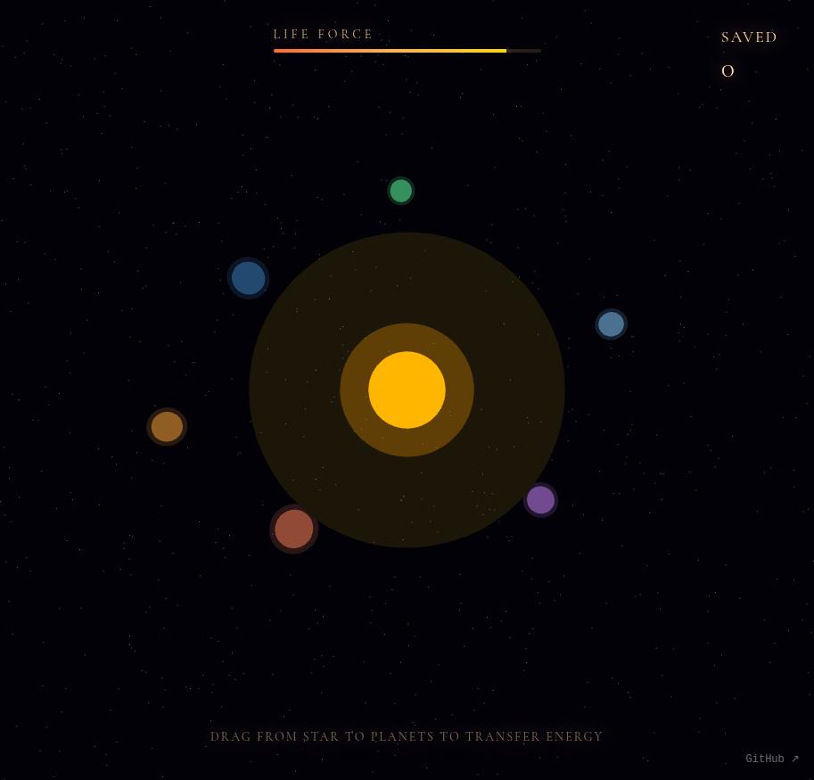

# Stellar End

A dying star's final act—a puzzle of light and sacrifice.

In Stellar End, you play as a dying star in its last moments. Draw gravitational threads from yourself to nearby planets, distributing your remaining life force to save as many worlds as possible before you collapse into silence.

## How to Play

- **Click and drag** from the central dying star to any planet
- Each thread costs **8 energy** and transfers life force to the target planet
- **Order matters**: Some planets can only receive energy after their dependencies are saved (shown by connections)
- Save at least **3 planets** to win before your energy depletes

### Objective
Save at least 3 planets before your star completely collapses. The more planets you save, the greater your legacy.

## Built With
- [Three.js r183](https://threejs.org/)
- [Tone.js v15.1.22](https://tonejs.github.io/)

## Links
- **Play:** https://nishivector.github.io/stellar-end/
- **Repo:** https://github.com/nishivector/stellar-end
